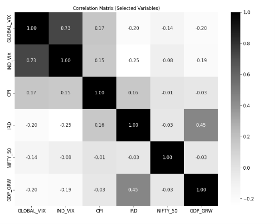
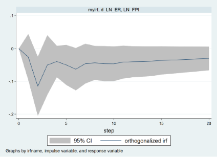
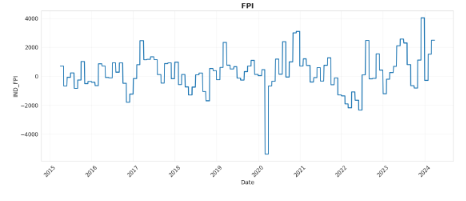

# Exchange-Rate Volatility and FPI Flows in India: An Empirical Investigation
This project investigates how exchange-rate movements influence Foreign Portfolio Investment (FPI) flows into India using daily macro-financial data. Multiple econometric techniques were employed to identify both short-run and long-run relationships.

## 📌 Objective

This study investigates how exchange-rate volatility and its long-run fundamentals 
affect Foreign Portfolio Investment (FPI) flows into India, and tests whether the 
causal relationship between FPI and exchange-rate movements is unidirectional or 
bidirectional.

## ❓ Research Questions

1. What is the effect of the exchange rate and its volatility on FPI flows, in 
   both the short run and long run?
2. Is the causality between exchange-rate fluctuations and FPI flows bidirectional 
   or unidirectional?
3. How do domestic indicators (NIFTY 50, India VIX) and global indicators 
   (Global VIX, interest-rate differentials) shape FPI behavior?

## 🗂️ Data

- **Period**: April 1, 2015 – March 29, 2024 (2,348 daily observations)
- **Sources**: RBI, NSDL, NSE, MOSPI, CBOE VIX, US Treasury, Investing.com
- **Variables**: FPI net inflows, exchange rate (INR/USD), FX volatility (30-day 
  rolling SD), forex reserves, India VIX, Global VIX, interest-rate differential, 
  CPI inflation, GDP growth, NIFTY 50 returns

## 🔬 Methodology

| Step | Technique | Purpose |
|---|---|---|
| 1 | ADF unit-root tests | Check stationarity / order of integration |
| 2 | OLS + VIF diagnostics | Baseline relationships, check multicollinearity |
| 3 | ARDL Bounds Test (Pesaran-Shin-Smith) | Test for long-run cointegration |
| 4 | ARDL–ECM | Estimate long-run equilibrium & short-run adjustment |
| 5 | Newey-West HAC regression | Correct for heteroskedasticity/autocorrelation |
| 6 | VAR(4) + Granger causality | Test direction of causality |
| 7 | Orthogonalized Impulse Response Functions | Trace FPI's dynamic response to 
    exchange-rate shocks |

## 📊 Key Results

**Long-run (ARDL-ECM):**
- Exchange rate (LN_ER): large, negative, significant (coef = –1410.6, p = 0.008) 
  → sustained rupee depreciation strongly discourages FPI inflows
- NIFTY 50: large, positive, significant (coef = 381.3, p = 0.005) → strong equity 
  performance attracts FPI
- Error Correction Term = –0.0418 (p < 0.001) → ~4.2% of disequilibrium corrected 
  daily

**Short-run (Newey-West HAC):**
- Exchange-rate changes show a two-day overshoot-correction pattern
- Inflation surprises and NIFTY daily returns significantly affect short-run FPI

**Granger Causality (VAR):**
- Exchange rate → FPI: significant (χ² = 7.98, p = 0.0185)
- GDP growth → FPI: significant (χ² = 11.05, p = 0.004)
- FPI → Exchange rate: **not** significant (χ² = 3.96, p = 0.411)
- → Causality is **unidirectional**: exchange rate and growth predict FPI, not 
  the reverse

**Impulse Response Function:**
- A currency depreciation shock triggers an immediate, sharp FPI outflow (peaking 
  around day 2), a persistent negative effect through the medium term, and no 
  reversal even after 20 days

## 🖼️ Figures

## 🧭 Policy Implications

- Exchange-rate stability and transparent RBI communication are critical to 
  sustaining FPI inflows
- Deeper FX derivatives/hedging markets could reduce panic-driven outflows
- Reserve buffers and targeted macroprudential tools can cushion extreme 
  volatility without closing the capital account

## 🛠️ Tools Used

Stata (ARDL, VAR, ECM, diagnostics), Python (data visualization)

## 📄 Full Paper

See [`AMFE TERM PAPER.pdf`](https://github.com/14haripriya-cyber/exchange-rate-fpi-analysis-/blob/main/AMFE%20TERM%20PAPER.pdf) for the complete write-up, 
literature review, full tables, and references.
